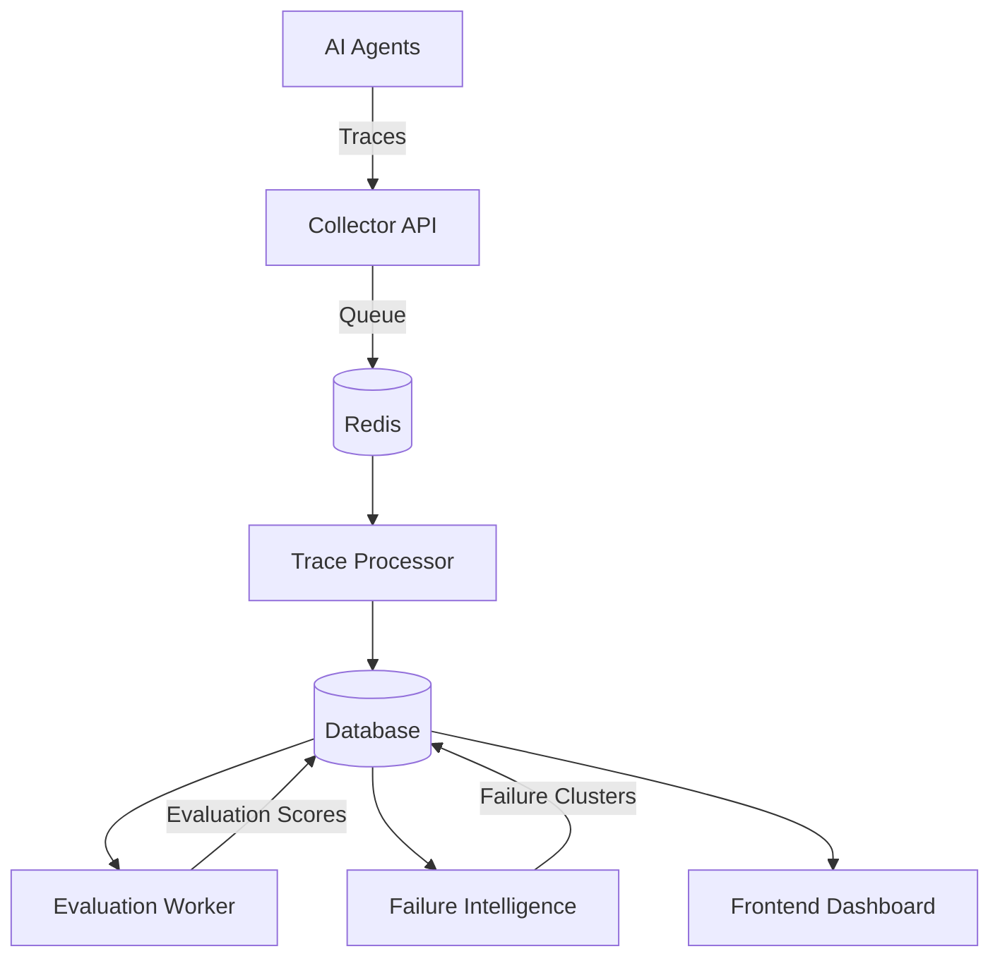

# LLM Agent Eval & Tracing Infrastructure

**Evaluation and observability infrastructure for production-grade LLM agents.**

This project provides an evaluation and observability layer for AI agents across voice, messaging, and email workflows. It bridges the gap between raw LLM outputs and production reliability through quantitative evaluation, end-to-end tracing, automated failure discovery, and adversarial testing.

The system is designed to make agent behavior measurable, debuggable, and continuously improvable.

---

## 🚀 Key Capabilities

### 1. Evaluation Infrastructure

The platform provides automated evaluation of LLM agent outputs using numerical quality metrics.

* **Automated Evaluation:** Integrates evaluation workflows with DeepEval and Promptfoo.
* **Quality Metrics:** Measures dimensions such as answer relevancy, faithfulness, and hallucination-related behavior.
* **Asynchronous Evaluation:** `eval_worker.py` processes stored traces independently from the main API flow.
* **Evaluation Snapshots:** Stores evaluation results so agent performance can be compared across runs and configuration changes.

### 2. End-to-End Tracing & Explainability

Every agent interaction can be captured and decomposed into traceable execution steps.

* **Trace Collection:** FastAPI endpoint for ingesting OTLP-like trace payloads.
* **Span-Level Visibility:** Tracks LLM calls, tool executions, retrieval operations, and agent execution steps.
* **Asynchronous Processing:** Redis-backed processing separates trace ingestion from downstream analysis.
* **Trace Exploration:** The frontend provides interactive visualization of individual agent execution paths.

### 3. Failure Intelligence

The system automatically identifies recurring patterns in low-quality or failed agent interactions.

* **Semantic Clustering:** Uses `sentence-transformers` to generate representations of agent responses and failures.
* **Failure Clustering:** Uses `scikit-learn` clustering techniques to group similar failure cases.
* **Failure Analysis:** Helps identify recurring issues such as poor responses, prompt failures, and tool-calling problems.
* **Actionable Insights:** Groups related failures so recurring production issues can be investigated systematically.

### 4. Red-Teaming & Adversarial Testing

The project includes an adversarial testing layer for evaluating agent robustness.

* **Attack Simulation:** Scripts for testing prompt injection, jailbreak attempts, and role-manipulation scenarios.
* **Attack Logging:** Records adversarial test inputs and outcomes.
* **Robustness Analysis:** Enables comparison of agent behavior across different attack categories.
* **Failure Tracking:** Connects adversarial failures with evaluation and observability data.

### 5. Configuration & Evaluation Changelog

Agent configuration changes can be tracked alongside evaluation results.

* **Configuration Tracking:** Records changes to prompts and model-related configurations.
* **Versioned Evaluation:** Enables comparison of evaluation results across configuration versions.
* **Performance Comparison:** Helps identify whether a change improves or degrades agent quality.
* **Experiment History:** Maintains a historical record of evaluation results for iterative development.

---

## 🛠 Tech Stack

### Backend

* Python
* FastAPI
* SQLAlchemy
* Redis

### AI / ML

* DeepEval
* Promptfoo
* Sentence-Transformers
* Scikit-learn
* OpenAI
* LangChain

### Frontend

* Next.js
* TypeScript
* Tailwind CSS
* Recharts
* ReactFlow

### Observability

* OTLP-compatible trace ingestion
* Trace processing pipeline
* Span-level execution tracking
* Evaluation and failure analytics

---

## 🏗 Architecture



---

## 🔍 Project Architecture

The infrastructure follows a decoupled architecture in which trace collection, processing, evaluation, and visualization operate as separate components.

### 1. Backend

The backend is implemented using Python and FastAPI.

#### Collector API

Receives trace data from AI agents through API endpoints and prepares it for downstream processing.

#### Trace Processor

Processes incoming traces and decomposes agent executions into individual evaluatable units such as LLM calls, tool executions, and retrieval steps.

#### Evaluation Worker

Runs evaluation metrics asynchronously so evaluation workloads do not block trace ingestion.

#### Failure Intelligence

Analyzes evaluation results and agent outputs to identify recurring patterns across failed or low-quality interactions.

---

### 2. Frontend

The frontend is implemented using Next.js and TypeScript and provides an interface for exploring agent behavior.

#### Performance Dashboard

Displays evaluation metrics and agent performance trends.

#### Trace Navigator

Provides interactive visualization of agent execution traces and individual spans.

#### Evaluation Reports

Provides detailed evaluation results for individual agent runs.

#### Failure Analysis

Allows users to inspect recurring failure patterns and grouped failure cases.

---

### 3. Data & Processing

The system uses a persistent data layer for storing traces, evaluation results, and failure-analysis information.

* **SQLAlchemy:** Database abstraction and persistence layer.
* **Redis:** Queue and asynchronous processing infrastructure.
* **Trace Storage:** Stores agent execution and evaluation information.
* **Evaluation Storage:** Maintains historical evaluation results for comparison.
* **Failure Data:** Stores information generated by failure-analysis workflows.

---

## 📊 Evaluation Metrics

The evaluation layer supports multiple dimensions of agent quality and reliability.

* **Answer Relevancy:** Measures how well an agent response addresses the user's request.
* **Faithfulness:** Evaluates whether generated responses are grounded in the available context.
* **Hallucination Detection:** Identifies potentially unsupported or inconsistent responses.
* **G-Eval:** Enables LLM-based evaluation using custom evaluation criteria.
* **Latency Analysis:** Tracks execution latency across agent runs.
* **Token Analysis:** Captures token usage for cost and efficiency analysis.

---

## 🛡️ Adversarial Testing

The `scripts/` directory contains utilities for testing agent robustness against adversarial inputs.

Example testing categories include:

* Prompt injection
* Jailbreak attempts
* Role manipulation
* Instruction conflicts
* Malicious or unexpected inputs

The resulting interactions can be analyzed alongside normal evaluation traces to identify weaknesses in agent behavior.

---

## 🏃 Getting Started

### Prerequisites

* Python 3.10+
* Node.js 18+
* Redis
* `pnpm`

### Backend Setup

```bash
cd backend

python -m venv venv

# macOS / Linux
source venv/bin/activate

# Windows
# venv\Scripts\activate

pip install -r requirements.txt

python -m app.main
```

### Frontend Setup

```bash
cd frontend

pnpm install
pnpm dev
```

The frontend will be available at:

```text
http://localhost:3000
```

---

## 📁 Repository Structure

```text
.
├── backend/
│   ├── app/
│   └── ...
├── frontend/
│   └── ...
├── scripts/
│   └── ...
├── tests/
│   └── integration/
├── docker-compose.yml
└── README.md
```

---

## 🎯 Project Goal

The goal of this project is to build the infrastructure required to move LLM agents from experimentation toward measurable and observable production systems.

Instead of treating an agent as a black box, the platform provides a feedback loop:

```text
Agent Execution
      ↓
Trace Collection
      ↓
Trace Processing
      ↓
Evaluation
      ↓
Failure Detection
      ↓
Analysis
      ↓
Configuration / Prompt Improvements
      ↓
New Evaluation
```

This creates a foundation for continuously measuring and improving LLM agent reliability.
