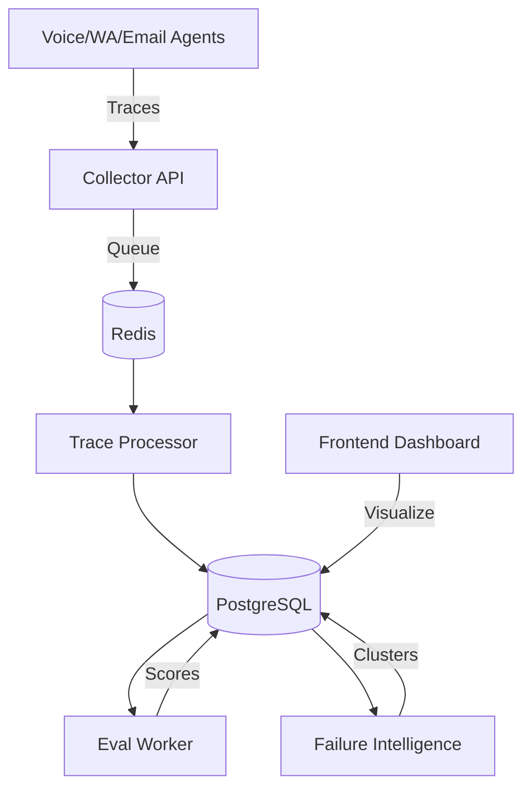

# Varshabubu: Riverline Agent Intelligence & Evaluation Platform

**The Nervous System of the Bank of 2035.**

Varshabubu is the core evaluation and observability infrastructure for [Riverline](https://riverline.ai). It powers our mission to serve credit-starved Indians by ensuring our AI agents (Voice, WhatsApp, Email) are precise, auditable, and constantly improving.

This platform bridges the gap between raw LLM outputs and production-grade reliability through numerical evaluation, automated failure discovery, and adversarial testing.

---

## 🚀 Key Ownership Areas (JD Alignment)

### 1. Evaluation Infrastructure (Numerical Measurement)
We don't guess; we measure. Varshabubu integrates with **DeepEval** and **Promptfoo** to quantify prompt and model quality.
- **Goal → Monitor → Response:** Closed-loop tracking of agent performance.
- **Metric Suite:** Automated scoring for Answer Relevancy, Faithfulness, and Hallucination detection.
- **Worker-Based Execution:** `eval_worker.py` asynchronously processes traces to generate numerical snapshots of agent health.

### 2. End-to-End Tracing & Explainability
Every interaction is a dataset for the future. 
- **OTLP-Compatible Collector:** High-performance FastAPI endpoint (`/api/v1/traces`) that ingests OTLP-like payloads.
- **Span-Level Detail:** Full visibility into LLM calls, tool executions, and agent reasoning chains.
- **Trace Processor:** Decoupled background processing via Redis queue to ensure zero-latency impact on production agents.

### 3. Failure Intelligence (Self-Evolving Systems)
Automating the discovery of ML problems in production.
- **Automated Clustering:** Uses `scikit-learn` (KMeans) and `sentence-transformers` to group similar agent failures or low-quality responses.
- **Root Cause Analysis:** Identifies patterns in failure modes (e.g., specific prompt templates or tool-calling errors) to drive direct production fixes.

### 4. Red-Teaming & Adversarial Sandbox
Protecting the bank from the edge cases of tomorrow.
- **Attack Simulation:** Built-in scripts for simulating jailbreaks, prompt injections, and role manipulation.
- **Adversarial Logging:** Dedicated schema for tracking attack success rates and payload effectiveness.

### 5. The Changelog System
Iterate fast, roll back instantly.
- **Auto-Logging:** Every change to STT, TTS, LLM configurations, or Prompt templates is versioned and logged.
- **Performance Snapshots:** Links every change to its net impact on evaluation scores.

---

## 🛠 Tech Stack

- **Backend:** FastAPI, SQLAlchemy (PostgreSQL), Redis.
- **AI/ML:** DeepEval, Scikit-learn, Sentence-Transformers, OpenAI, LangChain.
- **Frontend:** Next.js 15+, TypeScript, Tailwind CSS, Recharts, ReactFlow (Trace Visualization).
- **Observability:** OTLP-compatible ingestion, Custom Trace Processor.

---

## 🏗 Architecture



---

## 🏃 Getting Started

### Prerequisites
- Python 3.10+
- Node.js 18+
- Redis

### Backend Setup
```bash
cd backend
python -m venv venv
source venv/bin/activate
pip install -r requirements.txt
python -m app.main
```

### Frontend Setup
```bash
cd frontend
pnpm install
pnpm dev
```

---

## 🧠 Founder Mode & Philosophy

At Riverline, we prioritize **speed over comfort** and **momentum over process**. 
- **AI-First Operating OS:** We don't just use AI; we build systems that allow AI to improve itself.
- **Patch, Fork, Build:** We don't wait for open-source; we ship what's needed by tonight.
- **Paranoia as a Virtue:** If metrics aren't moving, we're failing.

---

## 📬 Contact
Built with ❤️ by the Riverline Team.  
[team@riverline.ai](mailto:team@riverline.ai)
